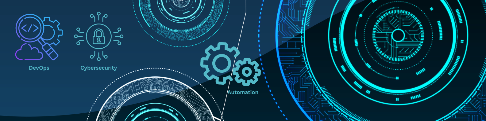

# Hi there, I'm Khudadad Khawari! 👋

Cloud & DevOps Engineer | Cybersecurity Enthusiast

I work on cloud infrastructure, Kubernetes platforms, CI/CD pipelines, deployment automation, observability, and secure software delivery. I come from a backend development background, so I’m comfortable across the full software development lifecycle — from application code to production infrastructure.

## 🚀 What I Do
- Build and maintain cloud infrastructure on AWS
- Manage Kubernetes platforms and production deployments
- Design and improve CI/CD pipelines for secure delivery
- Automate deployments across cloud and on-prem environments
- Implement observability, logging, and monitoring stacks
- Work on SSO, RBAC, secrets management, and system hardening

## 🛠️ Core Skills

### Cloud, DevOps & Automation
- AWS (EKS, EC2, S3, VPC, IAM, Route 53, Secrets Manager, CloudWatch)
- AWS CDK, CloudFormation
- GitLab CI/CD, CodeBuild, CodePipeline
- Docker, Docker Compose, Kubernetes
- ArgoCD, Istio
- Terraform, Ansible, Packer, Pyinfra
- Shell Scripting, Python

### Monitoring & Logging
- Prometheus
- Grafana
- Alertmanager
- AWS CloudWatch
- Loki
- ELK / EFK Stack

### Security
- HashiCorp Vault
- AWS Secrets Manager
- NIST-based security practices
- SonarQube, Trivy, SBOM
- System Hardening, Access Controls
- OpenVAS
- OWASP ZAP / ZAP Proxy
- SIEM tools
- ClamAV

### Infrastructure & Systems
- Proxmox
- CEPH
- pfSense
- Nginx
- Linux Networking & Administration
- Virtual Machine Management
- Golden Image / AMI / Template Automation

### Backend Development
- Django, Flask, FastAPI
- REST API Development
- PostgreSQL, MySQL, MongoDB
- Python, Selenium, Boto3, BeautifulSoup, NumPy, Pandas, OpenCV

## 📌 Experience Highlights
- Migrated and managed products on AWS EKS
- Built and maintained secure CI/CD pipelines with quality and vulnerability checks
- Managed Kubernetes environments with GitOps workflows
- Implemented SSO and RBAC using Keycloak across multi-service products
- Automated deployments for both AWS and on-prem Proxmox environments
- Built monitoring and logging stacks for production systems
- Automated creation and hardening of golden images using Packer and Ansible

## 🧰 Tools & Technologies

## 🎓 Education & Certification
- Bachelor of Computer Application (BCA)
- Google Cybersecurity Certificate

## 🌍 Languages
- English
- Persian
- Pashto

## 📫 Contact
- Email: Khudadad@SeferYak.com
- [LinkedIn](https://www.linkedin.com/in/KhudadadKhawari)
- [GitHub](https://github.com/KhudadadKhawari)

## 📈 GitHub Stats

